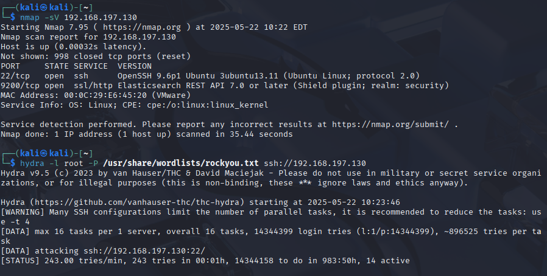
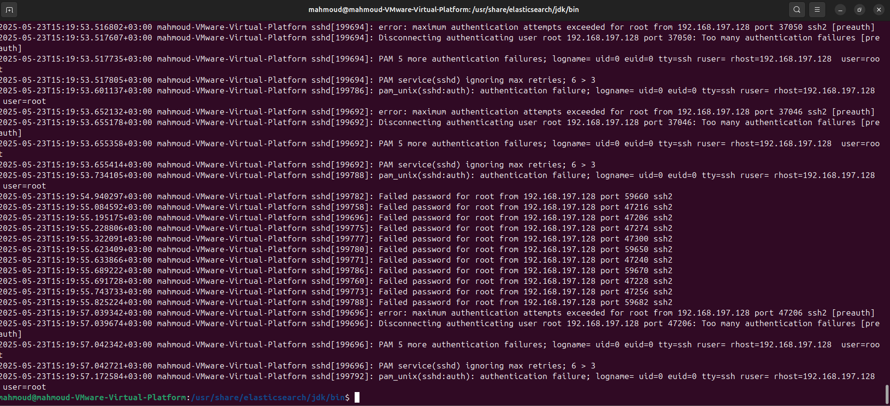
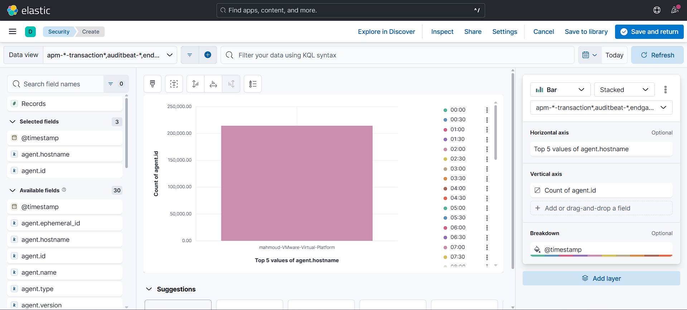

<h2 align="center">🔍 Cybersecurity Projects 🔍</h2>

----------------------------------------------------------------------------
<h3>💻 TryHackMe – Pre-Security & SOC Level 1 </h3>
- Completed structured learning paths covering core cybersecurity concepts
- Earned certificates of completion

----------------------------------------------------------------------------
<h3>🐍 Python SSH_Analyzer </h3>
- A Python-based script that parses SSH logs to detect brute-force attacks, suspicious logins, and unauthorized access attempts.
  The script is integrated with a SIEM (Splunk), for easiar monitoring and detection.
#### Screenshoots from the project:

  
  

### Some code snippets screenshoots:

  
  

----------------------------------------------------------------------------
<h3>🛡️ Home SOC Lab Project – Threat Detection & Analysis Simulation</h3>
**1. Introduction**
- This project simulates a Security Operations Center (SOC) environment in a home lab setting. It was created to develop and demonstrate key skills required for a 
  SOC Analyst Level 1 position. The lab involves setting up virtual machines, configuring a SIEM tool, simulating attacks, detecting threats, and documenting the 
  analysis.

**2. Objectives**
  - Build a virtual SOC environment using VMware with Kali Linux and Ubuntu
  - Install and configure a SIEM tool
  - Simulate cyber attacks
  - Detect and analyze suspicious activities
  - Document incidents and map them to the MITRE ATT&CK framework

**3. Tools & Technologies Used**
  - VMware Workstation
  - Kali Linux
  - Ubuntu
  - SIEM Tool (elastic)

**4. Lab Setup**

The lab was built using VMware Workstation with the following components:
  - Kali Linux: Used as the attacker machine to simulate cyber threats
  - Ubuntu Server: Configured with logging and monitored by the SIEM
  - SIEM Tool: Installed to collect, analyze, and alert on security logs

#### Screenshoots from the project 📷

 
 
 

 
 

